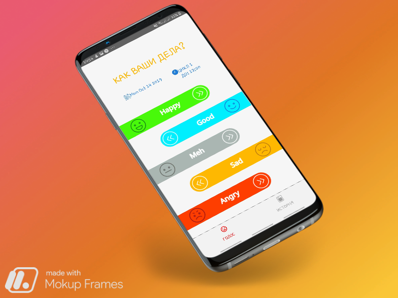
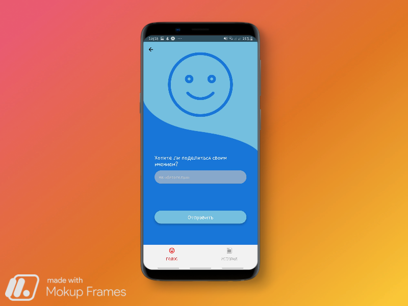
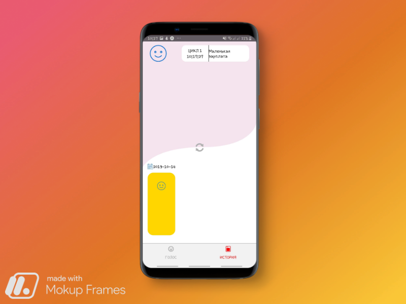

# AlfaMood

#### *AlfaMood mobile app working on React Native*

----------------------------------------------------------------
To install:
  In the working directory run this lines in the command prompt
  1) git clone https://github.com/ZhanZhaksylyk/AlfaMood/
  2) cd AlfaMood
  3) npm install
  4) npm start
 
 ----------------------------------------------------------------
 
 Record your mood, the reason for this change and see how your it changes through the day and over a last three days.
 
 ### Demo of the app
 
 1. Login using the departaament code of your company
 
 
 
 2. Welcome to your page! Now you can vote. Just swipe through the mood you have now
 
 
 
 3. Ehat is the reason? What's matter? But If you don't want just submit it without a content
 
 
 
 4. See how your mood changed thought last 3 days
 
 
 
 5. Enjoy your day!
 
 
